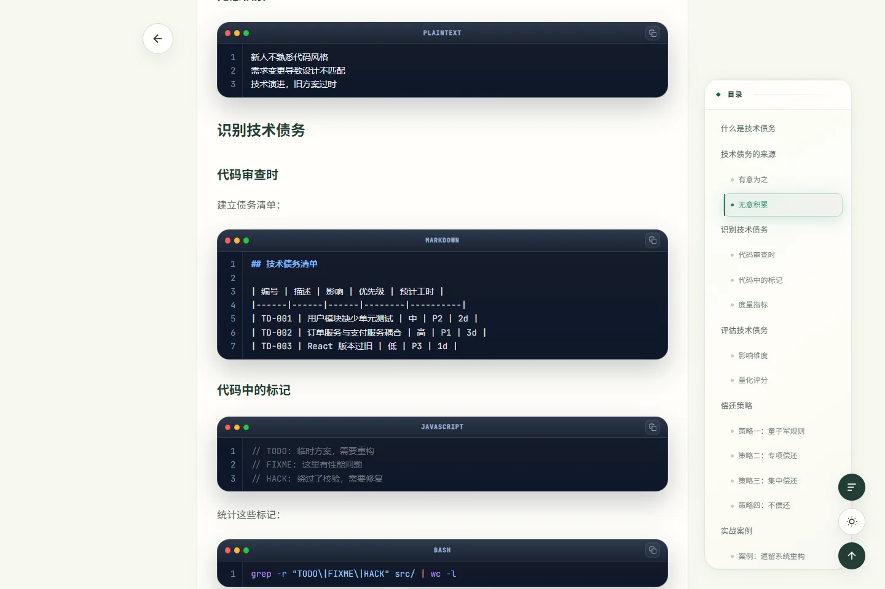
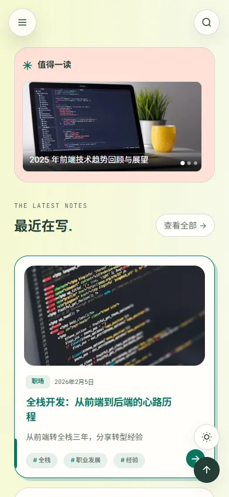
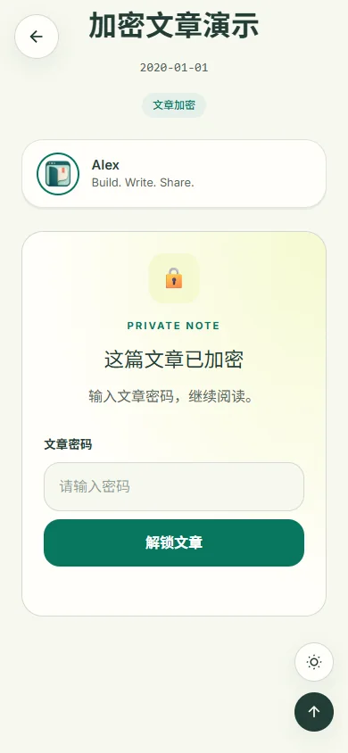

# Mintfolio

把个人主页和博客放在一起，用 Markdown 写文章，用主题决定它们的样子。

Mintfolio 基于 Astro。站点目录保存你的资料、文章和图片；引擎负责内容发布、静态路由、全文搜索、订阅、SEO 和密码文章。换一个主题，内容仍然留在原处。

[博客能力与配置](docs/wiki/Blogging-Features.md) · [部署与子目录](docs/deployment.md) · [使用教程](https://github.com/MintfolioBlog/mintfolio/wiki/Getting-Started) · [命令参考](docs/cli.md) · [开发主题](https://github.com/MintfolioBlog/mintfolio/wiki/Theme-Development) · [更新记录](CHANGELOG.md) · [反馈问题](https://github.com/MintfolioBlog/mintfolio/issues)

*上图使用 Verdant 主题和示例资料。只安装引擎时，默认使用文字为主的 Minimal。*

## 能做什么

- 用 Markdown 管理文章和独立页面，支持固定链接、旧地址跳转、分类、标签和系列。
- 生成可直接访问的静态分页，按需加载全站全文搜索与关键词高亮。
- 配置作者、更新时间、阅读时长、相关文章，以及 RSS / Atom / JSON Feed。
- 在主页展示个人资料、技能、项目和社交链接。
- 为单篇文章设置密码，在浏览器中解锁正文。
- 通过命令行新建草稿、安装主题、修改配置并构建网站。
- 输出静态文件，部署到普通 Web 服务器或静态托管平台。

Core 自带 Minimal；[Verdant](https://github.com/MintfolioBlog/mintfolio-theme-verdant) 提供文章卡片、八套配色、明暗模式、目录和阅读工具。第三方主题可以从两个 Astro 页面开始，再逐步补齐自己的布局。

## 开始使用

需要 **Node.js >= 22.12.0**。项目仍在持续开发中。

~~~sh
npm install -g @mintfolio/core
mintfolio create my-blog
cd my-blog
mintfolio dev
~~~

打开终端显示的地址。站点根目录就是文章目录；站点资料、主题和独立页面都在 `_mintfolio/` 里。之后在站点里直接运行 `mintfolio`，可以通过菜单写文章、预览、构建和调整主题。已有一个放 Markdown 笔记的目录时，在其中运行 `mintfolio init` 即可。

想使用上图的 Verdant：

~~~sh
mintfolio theme install verdant --use
~~~

## 写第一篇文章

~~~sh
mintfolio post new "我的第一篇文章" --slug first-post
~~~

打开站点根目录的 first-post.md 写正文（不带参数运行 `mintfolio post new` 会逐项询问）。新文章默认是草稿，准备好后再发布并构建：

~~~sh
mintfolio post publish first-post
mintfolio build
mintfolio preview
~~~

post publish 修改本地草稿状态；build 生成 `_mintfolio/dist`；部署时上传其中的内容。[写作教程](https://github.com/MintfolioBlog/mintfolio/wiki/Writing) 介绍日期、封面、嵌套目录和密码文章。

部署到 `/blog-site/` 等子目录时，添加只含 `export default { base: '/blog-site/' }` 的可选 `_mintfolio/astro.config.mjs`，然后重新构建并上传完整 `_mintfolio/dist`。站点目录的约定见 [命令行文档](docs/cli.md#站点目录)。Core 会统一处理页面、资源、搜索与订阅地址；托管服务的 404 和域根 robots 配置见 [部署说明](docs/deployment.md)。

## 常用操作

| 想做什么 | 命令或文件 |
| --- | --- |
| 修改网站标题 | mintfolio config set site site.title "我的博客" |
| 编辑个人资料 | site.config.ts |
| 调整主题设置 | mintfolio config edit theme |
| 查看主题配置项 | mintfolio config schema theme |
| 本地预览草稿 | mintfolio dev --drafts |
| 检查内容和链接 | mintfolio check |
| 检查环境 | mintfolio doctor |
| 查看命令帮助 | mintfolio --help |

[配置教程](https://github.com/MintfolioBlog/mintfolio/wiki/Configuration) 说明内容与显示设置的区别、备案号、图片和配置优先级。

## 界面

 

## 开发状态

当前重点是完善写作流程、主题接口和跨平台安装。0.x 阶段仍可能调整接口；升级前请保留源文件与锁文件，并阅读版本说明。

目前需要知道的几件事：

- 默认隐藏草稿和未来文章；`mintfolio dev --drafts` 仅开启本地预览。定时文章在到期后需要重新构建。
- 搜索索引包含公开正文；加密文章只索引安全元数据，`seo.noindex` 内容不进入搜索与订阅。
- Minimal 目前不显示备案号；Verdant 的首页和普通页面支持 icp 字段。
- 密码文章的正文和目录会被加密，标题、图片等信息仍公开。
- CLI 负责本地操作与构建，部署由你选择的托管平台完成。

## 仓库

| 仓库 | 内容 |
| --- | --- |
| [mintfolio](https://github.com/MintfolioBlog/mintfolio) | 项目入口、CLI、博客引擎与 Minimal |
| [mintfolio-theme-verdant](https://github.com/MintfolioBlog/mintfolio-theme-verdant) | Verdant 主题 |
| [mintfolio-theme-api](https://github.com/MintfolioBlog/mintfolio-theme-api) | 主题的公共类型与契约 |
| [mintfolio-theme-starter](https://github.com/MintfolioBlog/mintfolio-theme-starter) | 可直接修改的主题起点 |

想贡献代码，从 [CONTRIBUTING.md](CONTRIBUTING.md) 开始。发现安全问题，请按 [SECURITY.md](SECURITY.md) 私下报告。

## 许可证

[GPL-3.0-only](LICENSE)。第三方依赖和资源保留各自许可证，见 [第三方声明](THIRD_PARTY_NOTICES.md)。

## 站点统计

Google Analytics 配置位于 site.config.ts 的 analytics.google，由 Core 仅在生产构建中统一注入，不依赖当前主题。迁移步骤与 GA4 自动页面浏览设置见 [统计配置](docs/analytics.md)。
